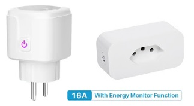
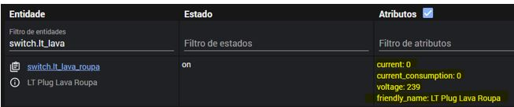
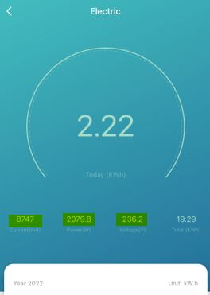

# From Dumb to Smart Washing Machine - Home Assistant


Use a power plug with an energy consumption monitor and Home Assistant to transform your dumb washing machine into a "smart" one with a bunch of informative features. Basically, we will use the measurements of power drawn by the washing machine connected in a smart plug (WIFI) with power monitoring. Depending on power drawn we can determine with some accuracy the status of the washing machine and automate some stuff.



## Before start

What do I need?

- A Washing Machine (Serious dude!?)
- :electric_plug: A Smart Power Plug (WIFI) Tuya/SmartLife Compatible (photo above)
  - https://a.aliexpress.com/_mLoZBgY (EU Socket Compatible) :european_union: - The one I used!
  - https://pt.aliexpress.com/item/1005003106242894.html (Brazilian Socket)) :brazil:
- [Home Assistant](https://www.home-assistant.io/) using [HACS](https://hacs.xyz/) and install:
  - [Local Tuya Integration](https://github.com/rospogrigio/localtuya) - yes! The offical Tuya integration still don't have the power monitoring attributes support.
  - [Card-mod](https://github.com/thomasloven/lovelace-card-mod) - to create our fancy button on lovelace dashboard
  - [Custom Button Card](https://github.com/custom-cards/button-card) - to create our fancy button on lovelace dashboard

## Initial Steps

First of all, I will consider that you _already_ added your smart plug as a switch under the Local Tuya Integration. If you don't know how to do it, I recommend this [video](https://www.youtube.com/watch?v=vq2L9c5hDfQ). As I said, the official Tuya integration doesn't provide the information we need (until the day I'm writing it) and Local Tuya is awesome since it don't rely on Tuya Cloud. So, on my setup the entity id is **switch.lt_lava_roupa** - see the power monitoring entity attributes on developer tools (image below)



- current
- current consumption
- voltage

Create the entities from the attributes adding this code to you **configuration.yaml** (or wherever you put it on your home assistant files)

```yaml
 - platform: template
   sensors:
      washingmachine_powerdraw:
        value_template: '{{ state_attr("switch.lt_lava_roupa", "current_consumption") }}'
        unit_of_measurement: 'W'
      washingmachine_current:
        value_template: '{{ state_attr("switch.lt_lava_roupa", "current") }}'
        unit_of_measurement: 'mA'
      washingmachine_voltage:
        value_template: '{{ state_attr("switch.lt_lava_roupa", "voltage") }}'
        unit_of_measurement: 'V'
```


## Staring your washing machine and Tuya/SmartLife app

Yes, now it's time to study your washing machine behaviour. (By the way, you can use this approach in order to transform other dumb devices into smart just analyzing the power consumption). Open you SmartLife/Tuya app (I use SmartLife) - select your smart plug and under **Electric** option you will see this: 



The important measurement is the **_Power_** in W (current consumption)! Now you will set some washing program on your machine, stare it and make notes about the consumption/action behaviour. In my case during the Washing the power value is above 1000 but during Rinse its just 500. Make note about every change to make the more accurate automations. 

## Washing Machine state and automations

Now we need to create an input_select entity to keep the washing machine state. You can add as many states you want in the options depending on your machine and how accurate were the power variations that define your machine's actions. So, go to your **configuration.yaml** and add the code below.

```yaml
input_select:
  state_washingmachine:
    name: Washing Machine state
    options:
      - Switched Off 
      - Powered Down
      - Idle
      - Rinse / Spin
      - Wash
    icon: mdi:washing-machine
```
So the automations code I've found on this [post](https://community.home-assistant.io/t/washing-machine-power-consumption-trigger/70938/6) from home assistant forums. Thanks user [Callifo](https://community.home-assistant.io/u/callifo) :+1:. Based on your power draw measurement the automations will set the state of your washing machine. Just edit the automations with your washing machine state id and the behaviour of your machine.

Download and open the [automations.yaml](automations.yaml) file on this project to check it and past the contents into your automations.yaml file on Home Assistant. Remember to change the entity id of your power plug (on this code there is the id of mine power plug). _Repeating, you can customize_ the automations accordingly your washing machine behaviour during the power variations and set the states properly.

So, right after this step you can use the _service: input_select.select_option_ to play with states changes of **input_select.state_washingmachine** entity on developer tools or start some cleaning program on your washing machine and see if it's behaviour fits the states you set on automations.

:warning: You need to add your own code to send notifications when the machine finish the job on **Washing Machine - Change State Powered Down** automation.

## Washing Machine job time elapsed feature

In order to make more cool features I added a counter to calculate the time elapsed from the moment the washing machine is powered on and starts washing until it's powered down. Unlike on washing machines that the time set by cleaning program will decrease (since its not possible to know what program you set on machine) - I created this time count thar starts from 00:00 and go.

Create a counter entity by adding this code to your *configuration.yaml*
```yaml
counter:
  wash_duration:
    initial: 0
    step: 1
```
Add the code below to your *automations.yaml* file. It will increment 1 second to the counter wash_duration from the moment the machine has any state that is not Powered Down or Switched Off. Also the reset automation will reset the counter to 0 when machine is powered down (no current consumption) or switched off (on smart plug).

```yaml
- id: washingmachine_startcounter
  alias: Counter Washing Machine Start
  trigger:
  - platform: time_pattern
    seconds: /1
  condition:
  - condition: not
    conditions:
    - condition: state
      entity_id: input_select.state_washingmachine
      state: Powered Down
    - condition: or
      conditions:
      - condition: state
        entity_id: input_select.state_washingmachine
        state: Switched Off
  action:
  - service: counter.increment
    target:
      entity_id: counter.wash_duration
  mode: restart
- id: washingmachine_resetcounter
  alias: Counter Washing Machine Reset
  trigger:
  - platform: state
    entity_id: input_select.state_washingmachine
    to: Powered Down
  - platform: state
    entity_id: input_select.state_washingmachine
    to: Switched Off
  condition: []
  action:
  - service: counter.reset
    target:
      entity_id: counter.wash_duration
  mode: single
```

Back to *configuration.yaml* again on sensor templating add the code below. This sensor will record the time elapsed to be show on your dashboard.

```yaml
 - platform: template
   sensors:
      wash_running_time:
        value_template: >
         
         {%- set seconds = (time % 60) | int -%}
         {%- set minutes = ((time % 3600) / 60) | int -%}
         {%- set hours = ((time % 86400) / 3600) | int -%}
         
         00:00
         
         {{ '{:02}:{:02}'.format(hours, minutes) }}
          
```
## Lovelace Dashboard Button

Since you have card-mod and button-card lovelace frontend integrations installed you can create the button to show information about the washing machine on your dashboard. Remember that the styles like card size, position and others were made to fit my personal dashboard. Change it accordingly yours:

```yaml
	type: custom:button-card
        color_type: auto
        entity: input_select.state_washingmachine
        name: Washing Machine
        show_state: true
        show_label: true
        label: >-
          [[[ if (entity.state == "Powered Down" || entity.state == "Switched
          Off") return ""; else return
          states["sensor.wash_running_time"].state;]]]
        icon: mdi:washing-machine
        styles:
          card:
            - height: 100px
            - width: 124px
            - background-color: |
                [[[
                  if (entity.state == 'Wash' || entity.state == 'Idle' || entity.state == 'Rinse / Spin') return 'rgba(46, 138, 197, 0.3)';
                  else return '';
                ]]]
          grid:
            - grid-template-areas: '"i" "n" "s" "l"'
            - grid-template-columns: 1fr
            - grid-template-rows: 1fr min-content
          img_cell:
            - align-self: start
            - text-align: start
          name:
            - justify-self: start
            - padding-left: 10px
            - font-size: 15px
          label:
            - justify-self: end
            - font-size: 15px
            - margin-top: '-150px'
            - margin-right: 10px
          state:
            - justify-self: start
            - padding-left: 10px
            - font-size: 15px
            - margin-bottom: 4px
          icon:
            - width: 31px
            - color: white
            - margin-left: '-80px'
            - margin-top: '-3px'
            - animation: |
                [[[
                  if (entity.state == 'Wash' || entity.state == 'Rinse / Spin') return 'blink 2s ease infinite';
                ]]]
```
